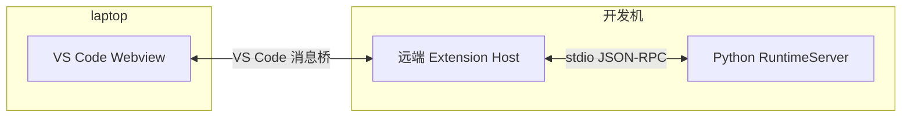

# 前端与运行时边界

CLI、React TUI 和 relay 终端适配器通过双向 JSON-RPC 使用同一个
`RuntimeServer`。聊天、命令、排队、打断、审批和退出保存由后端执行。
界面可以共享数据类型与展示逻辑，不得调用 `Agent`、`CommandService` 或会话存储。

## 当前实现

| 部分 | 职责 |
| --- | --- |
| `app/rpc/client.py` | Python 客户端、状态镜像、反向交互 |
| `app/rpc/{codec,models}.py` | 固定类型目录和序列化；保留已有类型位置与 wire tags |
| `app/rpc/server.py` | 后端操作入口、执行与交互生命周期 |
| `interfaces/entrypoint/` | 组装 Agent、连接、适配器，拥有后端清理责任 |
| `interfaces/cli/application.py` | 只接收已连接的客户端，渲染普通 CLI 或 host 状态 |
| `interfaces/relay.py` | RPC 客户端事件转成现有 HTTP peer 的终端输出、审批与控制协议 |
| `reuleauxcoder-client/src/message-peer.ts` | 不依赖 Node 的 JSON-RPC 消息关联、请求、通知、反向调用 |
| `reuleauxcoder-client/src/client.ts` | 不依赖 Node 的运行时 API；宿主显式传入自己的 UI profile |
| `reuleauxcoder-client/src/node/{peer,files}.ts` | Node 字节流 framing 与前端本地文件读取 |
| `reuleauxcoder-tui/src/profile.ts` | TUI 身份与支持的界面能力 |

本地 CLI 继续使用内存传输，但消息经过真正的 JSON 编解码，不传递后端对象。
TUI 继续使用 stdio。relay 保留 Go peer 的 HTTP 协议及 host 上的 Rich 渲染，
每个 peer 使用独立且持久的 runtime/client；一轮 HTTP 聊天结束不会销毁 runtime。
relay 的保存回调仍由后端 composition root 注册为 `runtime.checkpoint`，
原有保存失败的结构化诊断与避免重复退出快照的行为保留。

`initialize` 返回 `presentation`、`model_configured`、`host_mode` 和
`runtime_environment`；工作目录来自 runtime snapshot。前端不读取后端 Config
对象或用本机环境冒充后端环境。API key 不进入这些初始化元数据。
输入历史路径由前端宿主决定；本地 CLI 的组装入口沿用配置路径，远程前端不接收它。
图片以有界字节块上传，文件路径留在前端。
启动和会话恢复共用有界对话预览，包含 Unicode 与 JSON 转义后的大小预算；
截短时明确提示通过历史分页读取原文，避免单次恢复内容超过 stdio 帧上限。

通用内置命令按 capability 匹配，不限定 `cli/tui/vscode` 名字；显式指定
`ui_targets` 的扩展命令仍受其限制。推理显示偏好只作为展示提示，不能改变中断时
写入模型历史的事实。

包的公共兼容导出按需加载。导入 Python 客户端、CLI 界面或 relay 界面不会连带
加载 Agent、LLM 或工具注册表；启动 stdio 后端不会加载 Rich 或 prompt_toolkit。
TypeScript 协议代码通过仓库内部包 `@reuleauxcoder/client` 共享，默认入口无
Node 或 UI 框架依赖，`/node` 单独提供 Node 适配器。该包不独立发布 npm，
TUI 使用本地依赖并沿用现有构建工具链。用法见[共享客户端](../reuleauxcoder-client/README.md)。

## 宿主与视图生命周期

视图的挂载、监听解除与后端进程生命周期是两件事。宿主保留客户端和进程，
关闭一个视图只移除其监听；明确退出会话时才请求 `runtime.shutdown`。
TUI controller 销毁时解绑自身订阅、取消刷新，并忽略尚未完成的面板和历史请求；
同一客户端上的其他视图和宿主监听继续工作。
Python 的 `LocalConnection.close()` 是本地组装入口使用的整体清理操作。
TypeScript 的 `client.close()` 关闭传输，`client.shutdown()` 还请求后端保存退出。
当前 stdio 后端会在 EOF 时清理退出，因此视图卸载也不应关闭宿主持有的 stdio。

退出请求没有固定的 RPC 总时限：宿主等到保存完成、明确报错或连接断开后再清理
进程，避免慢磁盘上的正常 `fsync` 被前端超时打断。后端仍限制停止任务的等待时间，
并通过 `runtime.shutdown_progress` 通知推送停止任务、写入记录和提交快照的阶段。
TUI 保持显示当前阶段和累计等待时间；等待期间两次 Ctrl+C 可明确强制退出，
界面会提示保存可能不完整。进度通知不写入会话历史。

未来 VS Code Remote 的适配位置：

宿主负责 Python 启停和消息转发，Webview 使用通用消息客户端。Tauri 可以采用相同
边界，由桌面宿主管理 Python。当前没有实现这些产品适配器，也没有加入 daemon、
多客户端会话或断线后后台持续运行机制；完整宿主退出后仍按现有保存/恢复机制处理。

后端尚未完成初始化时的启动进度、stderr 和致命错误由宿主展示，属于启动诊断通道；
它们不承载聊天、命令或审批操作。

原生编辑器审批通过 `initialize.review_documents` 协商。`ReviewRequest.documents`
只携带快照元数据，`review.document(request_id, document_id, side, offset, limit)`
按最多 65,536 个 Unicode 字符读取审批期间冻结的修改前/后文本。路径不能作为读取
参数，审批取消或结束后快照立即失效。文本 diff 与原生预览都来自同一次捕获的文档
版本，实际修改仍由核心校验版本后执行。客户端原生预览上限为 4 Mi 字符，超过后应
展示文本预览和明确的大小提示。

编辑器宿主通过 `initialize.editor_documents` 协商未保存文档保护，并调用
`runtime.editor_documents(revision, paths)` 提交绝对路径集合。连接内 revision 单调
递增，晚到的旧状态不会覆盖新状态。宿主应在 `runtime.ready` 前同步初始状态，防止
恢复的 Goal 在编辑器状态到达前继续写入。核心在 `edit_file` / `write_file` 产生效果
前再次检查此集合，包括自动批准和子代理工具；该保护不拦截任意 shell 命令的写文件。
保存有冲突的编辑器后，宿主拒绝原审批并要求基于新的磁盘内容重新生成提案。

## 回归检查

- `tests/architecture/test_rpc_imports.py`：新解释器内拦截间接导入。
- `tests/architecture/test_presentation_boundaries.py`：覆盖整个 CLI 适配器与 relay UI。
- `tests/domain/agent/{test_loop,test_user_steering}.py`：普通轮次和最终总结的推理/内容中断不受显示模式影响。
- `tests/app/rpc/`、CLI/relay 集成测试：状态、命令、控制、审批、恢复、保存和 peer 隔离。
- `reuleauxcoder-tui/test/browser-protocol.test.ts`：浏览器目标打包，并在不提供 Node 全局对象的环境中运行消息、审批、字节上传和视图解绑。
- `reuleauxcoder-tui/test/client-package.test.ts`：只携带 client 编译产物的独立消费者、无 Node 类型的浏览器类型检查，以及 Node 入口打包边界。
- 既有 TUI framing、真实 Python、图片、PTY 和 bundle 测试继续运行。
